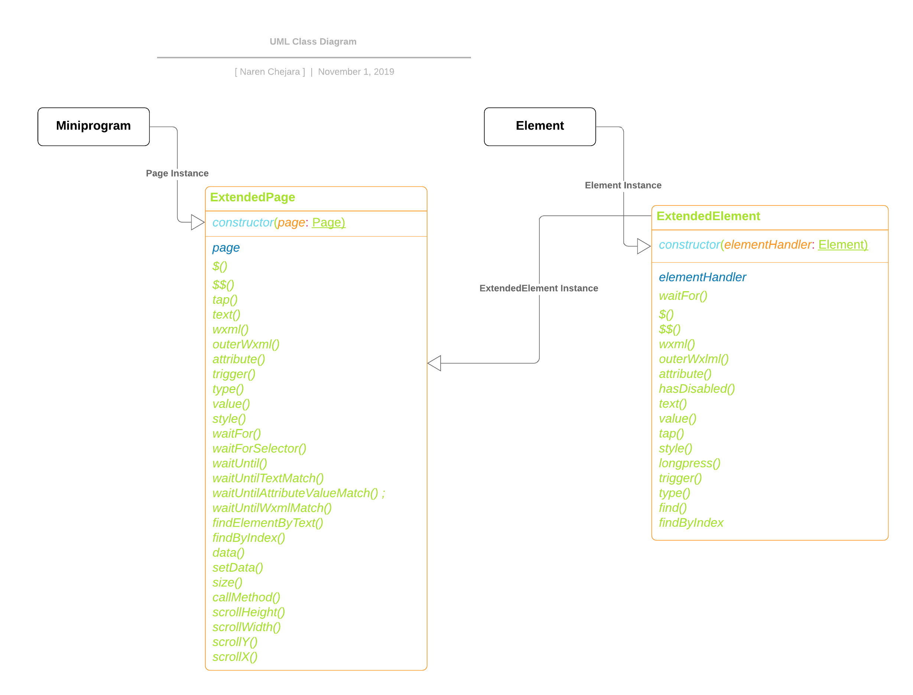

# **WeChat Mini program Automator Extension**

Miniprogram Automator extension package is an extended version of the [miniprogram-automator](https://www.npmjs.com/package/miniprogram-automator) package developed by the WeChat mini-program team. The Mini-Program Automator extension is a new approach to find and perform an action on the element. I want to simplify the functionalities so it may help the user write effortless end 2 end test scenarios.
 

The following functions are exposed on the page level (ExtendedPage) so the user can directly trigger actions on the page without calling *page.$('.selector')*. 

- **tap**: Tap on the element
- **text**: Get the text of the element
- **wxml**: Get this inner xml(html)
- **outerWxml**: Get outer xml(html)
- **attribute**: Get the attribute value of the element
- **trigger**: Trigger the element event such as focus, change
- **type**: Type in the input element, newly added
- **value**: Get the value of the input element
- **style**: Get the value of the Sytle attribute
- **waitFor**: Wait for specific time
- **waitFor**: Wait for the selector to be appeared
- **waitUntil**: Wait until specific parameter value not matched
- **waitUntilTextMatch**: Wait until specific text not appeared
- **waitUntilAttributeValueMatch**: Wait until attribute value match
- **waitUntilWxmlMatch**: wait until wxml not match
- **findElementByText**: Get the element if specific text matched
- **findByIndex**: Get the element by index
- and all rest of page function

 
 
 *You can refer *.d.ts files for more details**

## **How does it work**
**Miniprogram Automator Extenstion** library working pattern is slightly different from **Miniprogram Automator**. Let's understand this by tapping on the button element


### **Miniprogram-automator**
Find the element by calling **page.$('.selector')** and then trigger the action of that element.  

This is a good approach if you trigger multiple actions on the element

```
    const automator = require("miniprogram-automator-extension");
    
    (async () => {
        const miniApp = await automator.launch({cliPath: 'path/to/cli', projectPath: 'path/to/project);
        const page = await miniApp.navigateTo('Home');
        
        const btnElement = await page.$('.btn_element");
        await btnElement.tap();

        await miniApp.close();
    })();
```

### **Miniprogram-automator-extension**
The element selector can be passed directly in the action function. The function execute two actions together
- Find an element and 
- Trigger the action on the element 

This approch is useful when you want to trigger a single action on the element.

```
    const automator = require("miniprogram-automator-extension");
    const ExtendedPage = require("miniprogram-automator-extension");

    (async () => {
        const miniApp = await automator.launch({cliPath: 'path/to/cli', projectPath: 'path/to/project);
        const extendedPage = new ExtendedPage(await miniApp.navigateTo('Home'));
        
        await extendedPage.tap('.btn_element); 

        await miniApp.close();
    })();
```

### **Installation**
```
    $ npm i miniprogram-automator-extension
```

*Note: This module is in under progress, therefore stay tune for new update